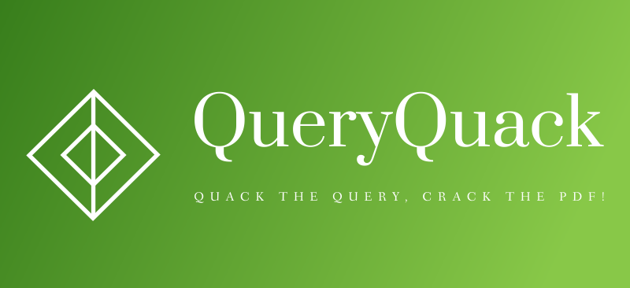
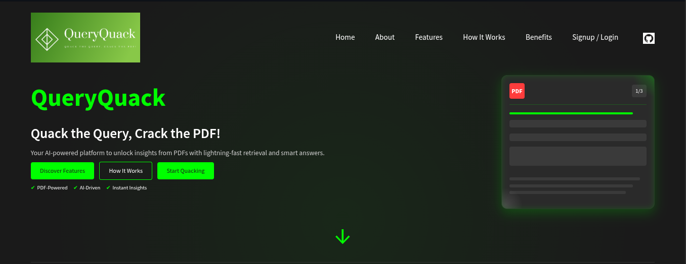
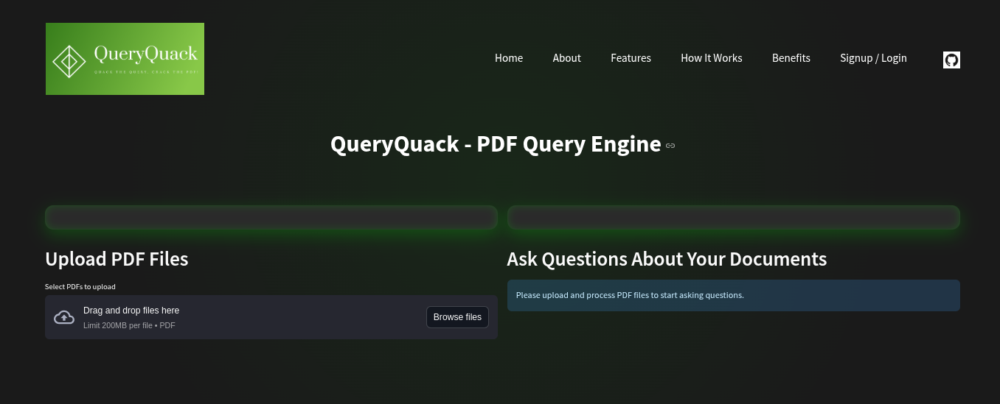

## Check Live - [HuggingFace space](https://huggingface.co/spaces/Subrahmanyagaonkar/QueryQuack)

<div align="center">



</div>

<h1 align="center">
QueryQuack
</h1>

<h4 align="center">
Quack the query, crack the PDF!
</h1>


<p align="center">
    <a href="https://github.com/negativenagesh/Resumai/stargazers"></a>
    <a href="https://github.com/negativenagesh/Resumai/network/members"></a>
    <a href="https://github.com/negativenagesh/Resumai/pulls"></a>
    <a href="https://github.com/negativenagesh/Resumai/issues"></a>
    <a href="https://github.com/negativenagesh/Resumai/blob/main/LICENSE"></a>
</p>

QueryQuack transforms how you interact with PDF documents by allowing you to have conversations with your documents instead of manually searching through them. QueryQuack is a  document query engine that allows users to upload PDFs and query them using natural language. The system uses vector embeddings and retrieval-based question answering to provide relevant responses based on the document content.

<div style= "padding: 20px; border-radius: 10px; animation: bounceIn 2s;"> <h2 style="color: #00d4ff;">Setup Instructions</h2> <p style="color: #b0b0b3;"> Follow these steps to set up QueryQuack locally</p>
```

1. Clone the Repository
```bash
git clone https://github.com/negativenagesh/QueryQuack.git
cd QueryQuack
```

2. Create a venv
```python
python3 -m venv .venv
source .venv/bin/activate
```  

3. Install Dependencies
```python
pip install -r pkgs.txt
```

4. Set up Gemini API
```bash
# Create a .env file in the project directory
touch .env

# Add your Gemini API key to the .env file
echo "api_key=your_api_key_here" >> .env
```
5. Set up Pinecone API

```bash
# Create a free Pinecone account at https://www.pinecone.io/
# Create a new project and index in the Pinecone console

# Add your Pinecone API key and environment to the .env file
echo "PINECONE_API_KEY=your_pinecone_api_key_here" >> .env
echo "PINECONE_ENVIRONMENT=your_environment_here" >> .env
echo "PINECONE_INDEX=your_index_name_here" >> .env
```
## Landing page

<div align="center">
    
</div>

## Main page

<div align="center">
    s
</div>

## Data Flow

1. Document Ingestion:
```txt
PDF Upload → Text Extraction → Chunking → Embedding Generation → Pinecone Storage
```

2. Query Processing:
```txt
User Query → Query Processing → Embedding Generation → Vector Search → Chunk Retrieval → Response Generation → Display
```

## How does QueryQuack work?

Document Processing Pipeline

1. Text Extraction:
PDFs are processed page by page to extract raw text
Document structure (headings, paragraphs) is preserved where possible
Images and non-textual elements are noted but not processed

2. Chunking:
Extracted text is divided into smaller, semantically meaningful segments
Each chunk maintains metadata about its source document and location
Chunks overlap slightly to preserve context across boundaries

3. Vector Embedding:
Each text chunk is transformed into a high-dimensional vector representation
These embeddings capture the semantic meaning of the text
Similar concepts will have similar vector representations, even if using different words

4. Storage in Pinecone:
All vector embeddings are stored in a Pinecone vector database
Documents are organized by user session to maintain privacy
The database enables ultra-fast similarity searching

Query Processing Pipeline

1. Query Understanding:
Your natural language question is analyzed for intent and key concepts
The system considers conversation context from previous questions
The query is transformed into a vector embedding using the same process as documents

2. Semantic Search:
The query vector is compared against all document chunk vectors
Pinecone performs this similarity search in milliseconds
The most relevant chunks are retrieved based on semantic similarity, not just keyword matching

3. Context Assembly:
The top matching chunks are compiled into a comprehensive context
This context represents the most relevant parts of your documents to answer the query
Source metadata is preserved for attribution

4. Response Generation:
The Gemini API uses the assembled context to generate a coherent answer
The response is formulated to directly address your question
Citations link back to the specific parts of your original documents.

Multi-Document Queries

* Ask questions that span multiple uploaded documents
* The system automatically finds connections between different sources
* Compare and contrast information across documents

Conversation Memory

* References to previous questions are understood (e.g., "Tell me more about that")
* The system maintains the conversation context throughout your session
* No need to repeat context in follow-up questions

Source Attribution

* Every answer shows exactly which documents contributed to the response
* Navigate directly to specific sections in source documents
* Verify information against the original content

## License

QueryQuack is released under the [Apache License](LICENSE).